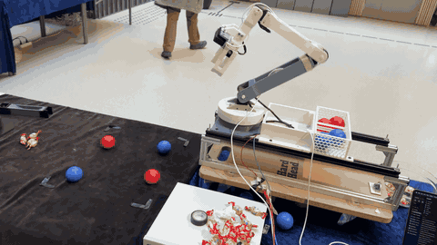

# Autonomia — Autonomous Ball-Sorting Robot


A vision-guided 4-DOF robotic arm that autonomously detects coloured balls using an OAK-D camera, computes inverse kinematics, and sorts them into bins. In the final MVP validation, the system sorted **20/20 balls correctly** across consecutive autonomous cycles with zero unrecovered failures, averaging 12.75 s per cycle (~4.7 balls/min).

<p align="center">
  
</p>
<p align="center"><em>The arm detecting, picking and sorting balls autonomously (5× speed) — <a href="docs/images/arm-demo.mp4">full video</a></em></p>

## Quick Start

### Prerequisites

| Component | Details |
|-----------|---------|
| **Host computer** | Raspberry Pi 5 (8 GB recommended) running Raspberry Pi OS Bookworm (64-bit) |
| **Python** | 3.11+ (ships with Bookworm) |
| **Camera** | Luxonis OAK-D S2 (USB-C) |
| **Motor controller** | OpenRB-150 + Dynamixel XM430-W210 / XM540-W150 / XL430-W250 servos |
| **Power supply** | Dual-output PSU — 12 V for motors, 5 V for Pi and camera |
| **Serial access** | User must be in the `dialout` group (`sudo usermod -aG dialout $USER`, then reboot) to access `/dev/ttyACM0` |

> **First-time Pi setup?** See [docs/pi-setup.md](docs/pi-setup.md) for a step-by-step guide.
> Full bill of materials and wiring details are in [docs/hardware.md](docs/hardware.md).

### Installation

```bash
git clone https://github.com/YOUR-USERNAME/Bachelor_prosjekt.git
cd Bachelor_prosjekt
python -m venv .venv && source .venv/bin/activate  # optional but recommended
pip install -e .                   # install project + pinned dependencies
```

### Running

```bash
# Simulation mode (default — no hardware needed)
python src/main.py

# Real hardware mode
python src/main.py --real-serial --real-camera
```

> **⚠️ First time on real hardware?** Complete the [calibration guide](docs/calibration.md) first (55–80 min). Running `--real-serial --real-camera` on an uncalibrated system may cause unexpected arm movements.

### Running Tests

```bash
pytest tests/                              # 28 unit tests (hardware-free)
pytest tests/ -v                           # verbose output
pytest tests/ --cov=src --cov-report=term-missing   # with coverage
```

> The automated suite (`tests/test_ik_solver.py`) covers IK reachability, sag compensation, and homography math — 28 tests, 100% passing, no hardware required.
> Hardware/GUI scripts are in `scripts/manual_tests/` — see [`scripts/manual_tests/README.md`](scripts/manual_tests/README.md).

## System Architecture

```
OAK-D Camera ──► VisionBridge ──► State Machine ──► IK Solver ──► OpenRB-150 ──► Dynamixel Motors
  (RGB stream)    (homography)      (main.py)      (geometric)     (serial)       (5 axes)
```

The system runs a continuous **move-to-scan-pose → scan → approach → pick → sort → drop → move-to-scan-pose → rescan** loop. The OAK-D camera captures frames, the vision pipeline detects balls using an HSV + Hough + SVM ensemble, a perspective homography converts pixel coordinates to centimetres, and the geometric IK solver computes motor positions for the 4-DOF arm. Communication with the five Dynamixel servos is handled via JSON commands over USB serial to an OpenRB-150 microcontroller.

See [docs/architecture.md](docs/architecture.md) for the full component diagram, state machine, and data flow.

## Project Structure

```
autonomia/
├── README.md                          📖 Project overview & quick start
├── CHANGELOG.md                       📝 Project changelog (semantic versioning)
├── LICENSE                            ⚖️  MIT licence
├── pyproject.toml                     📦 Build config, pinned deps, pytest settings
├── requirements.txt                   📦 Pinned Python dependencies
│
├── docs/                              📚 Full documentation
│   ├── architecture.md                🏗️  System design, state machine, data flow
│   ├── calibration.md                 🔧 10-step calibration guide (Steps 0–8)
│   ├── performance.md                 📊 Detection accuracy, cycle times, test protocol
│   ├── troubleshooting.md             🩺 Motor, camera & detection issue fixes
│   └── decisions/                     📐 Architecture Decision Records
│       ├── 001-hsv-over-cnn.md        🎨 Why classical HSV over CNN detection
│       ├── 002-4dof-geometry.md       📐 Why geometric IK over numerical
│       └── 003-fixed-scan-pose.md     🎯 Why fixed scan pose over continuous servoing
│
├── firmware/                          🎛️  OpenRB-150 firmware (flashed via Arduino IDE)
│   └── openrb_bridge/
│       └── openrb_bridge.ino          🎛️  OpenRB-150 Dynamixel bridge firmware
│
├── src/
│   ├── main.py                        ⭐ Master control loop (state machine)
│   ├── config/                        ⚙️  Unified configuration
│   │   ├── arm.py                     ⚙️  Arm coordinates, bin positions, timing
│   │   └── vision.py                  ⚙️  Camera resolution, ball size thresholds
│   │
│   ├── ik/                            🤖 Inverse kinematics & control
│   │   ├── solver.py                  📐 4-DOF geometric IK solver
│   │   └── vision_bridge.py           🔌 Camera → arm coordinate adapter
│   │
│   ├── vision/                        👁️  Computer vision pipeline
│   │   ├── camera.py                  📷 OAK-D S2 camera wrapper (DepthAI)
│   │   ├── classifier.py             🤖 SVM colour classification inference
│   │   ├── detector.py               ⭐ SimpleBallDetector — main detection engine
│   │   └── models/                    🧠 Trained ML models
│   │
│   ├── calibration/                   🔧 Calibration scripts and diagnostics (Steps 2–10 plus Step 2b validation)
│   │   ├── 02_joints.py              🔧 Motor sign & zero verification (Step 2)
│   │   ├── 02b_claw_grip_test.py     ✋ Step 2b adaptive claw/grip validation
│   │   ├── 02c_scan_pose.py          🎥 Wrist-camera scan pose tuning (Step 2c)
│   │   ├── 03_sag.py                 📐 Sag/droop compensation (Step 3)
│   │   ├── 04_hsv_tuner.py           🎨 Interactive live HSV trackbar tuner (Step 4)
│   │   ├── 05_hsv_refine.py          🔬 Analyse images → suggest new HSV ranges (Step 5)
│   │   ├── 06_homography.py          🎯 Pixel-to-cm homography calibration (Step 6, legacy)
│   │   ├── 09_touch_calibration.py   🤖 Touch-based homography calibration (replaces Step 6)
│   │   ├── 07_vision_offset.py       🔧 Fine-tune camera-to-shoulder offset (Step 7)
│   │   ├── 08_pick_test.py           🧪 End-to-end pick-and-place test (Step 8)
│   │   └── 10_bin_calibration.py     📦 Rear-bin route calibration (Step 10)
│   │
│   ├── diagnostics/                   🩺 Read-only diagnostic tools
│   │   ├── check_motor_errors.py     🩺 Decode Dynamixel hardware error flags
│   │   ├── diagnose_motors.py        🔍 Ping all motors & report connectivity
│   │   ├── diagnose_detection.py     🩺 Live mask + click-to-read HSV
│   │   └── stream_debug.py           🔎 Extended stream debugger
│   │
│   ├── simulation/                    🎮 Hardware-free testing
│   │   ├── mock_serial.py            🧪 Fake serial for testing without hardware
│   │   └── visualizer.py             📊 Live 3-D matplotlib arm visualiser
│   │
│   └── training/                      🏋️  Offline ML training tools
│       ├── capture_data.py            📸 Capture OAK images for training
│       └── train_classifier.py        🏋️  Train the SVM colour model
│
├── scripts/                           🧪 Manual test scripts
│   └── manual_tests/
│       ├── ik_virtual_demo.py         🧪 IK solver standalone simulation tests
│       ├── backend_check.py           🧪 Backend test runner
│       ├── enhanced_detector_demo.py  🧪 Live ball detection tests
│       ├── oak_v3_demo.py             🧪 OAK camera v3 tests
│       └── record_stats.py            📈 Run test + generate report charts
│
└── tests/                             🧪 Pytest test suite
    ├── conftest.py                    🔧 Shared pytest fixtures
    └── test_ik_solver.py              🧪 IK solver unit tests (28 tests)
```

## Documentation

| Document | Description |
|----------|-------------|
| [Architecture](docs/architecture.md) | System design, component diagram, state machine, data flow |
| [Calibration Guide](docs/calibration.md) | 10-step calibration pipeline (Steps 0–8, including 2b and 2c) |
| [Performance](docs/performance.md) | Detection accuracy, cycle times, test protocol |
| [Troubleshooting](docs/troubleshooting.md) | Motor errors, camera issues, detection problems |
| [Changelog](CHANGELOG.md) | Project changelog (semantic versioning) |
| [Manual Test Scripts](scripts/manual_tests/README.md) | Hardware validation & demo scripts |

### Design Decisions (ADRs)

| Decision | Summary |
|----------|---------|
| [ADR-001](docs/decisions/001-hsv-over-cnn.md) | Classical HSV vision over CNN-based detection |
| [ADR-002](docs/decisions/002-4dof-geometry.md) | Geometric 4-DOF inverse kinematics |
| [ADR-003](docs/decisions/003-fixed-scan-pose.md) | Fixed scan pose over continuous visual servoing |

## Key Results

### Final MVP Validation — 20/20 balls sorted (100%)

The MVP required ≥ 10 consecutive autonomous sorting cycles with > 90% detection rate, > 80% pick success, and 100% correct bin placement given correct colour classification. The final validation session exceeded all criteria over 20 consecutive cycles (10 red + 10 blue balls), run without restarting the system:

| Metric | Result |
|--------|--------|
| Net balls sorted correctly | **20 / 20 (100%)** |
| Blue balls picked and placed | 10 / 10 |
| Red balls picked and placed | 10 / 10 |
| Unrecovered failures | 0 |
| Grip-verification rejections | 1 (correctly rejected an unstable grasp; recovered by retry on the next scan) |

| Phase | Avg (s) | Min (s) | Max (s) |
|-------|--------:|--------:|--------:|
| Scan | 3.11 | 2.87 | 5.83 |
| Approach | 1.67 | 1.55 | 1.77 |
| Grab | 1.54 | 1.41 | 2.89 |
| Sort | 2.78 | 2.68 | 2.94 |
| Drop | 3.64 | 3.31 | 4.15 |
| **Total cycle** | **12.75** | **12.13** | **16.68** |

Average throughput: **~4.7 balls/min**. The maximum scan and grab times include the single retry-recovered grip rejection.

### Vision Pipeline

| Metric | Result |
|--------|--------|
| Red ball detection | 98–100% accuracy |
| Blue ball detection | 97–100% accuracy |
| False positive rate | < 2% |
| Processing speed | 20–25 FPS |

Three vision approaches were evaluated: CNN-based detection failed due to insufficient training data and 200–500 ms latency; a complex Kalman + hand-detection pipeline proved too fragile; the current HSV + Hough + SVM ensemble delivers reliable real-time performance.

See [docs/performance.md](docs/performance.md) for full metrics, cycle timing, and the standardised 10-ball test protocol.

## Hardware

The system uses a Dynamixel-based 4-DOF arm (M1/M3/M5 XM430-W210, M2 XM540-W150, M4 XL430-W250) controlled by an OpenRB-150 microcontroller via JSON-over-serial. Vision is provided by a Luxonis OAK-D S2 mounted on the arm wrist, looking down at the workspace (IMX378 sensor, configured at 640 × 400 for the detection pipeline, 81° HFOV). The arm runs on a Raspberry Pi 5 host.

| Parameter | Value |
|-----------|-------|
| L1 (Shoulder → Elbow) | 25.5 cm |
| L2 (Elbow → Wrist) | 23.0 cm |
| L3 (Wrist → Claw tip) | 22.0 cm |
| Max reach (theoretical) | 48.5 cm (L1 + L2) |
| Practical workspace radius | ~40 cm¹ |

¹ Practical reach is limited by motor torque and vertical clearance constraints.

See [docs/architecture.md](docs/architecture.md) for the full hardware specification and component descriptions.

## Calibration

The system requires a 10-step calibration pipeline (Steps 0–8, including 2b and 2c) before autonomous operation, covering motor setup, SCAN_POSE tuning for the wrist-mounted camera, sag compensation, HSV colour tuning, pixel-to-cm homography, and end-to-end pick verification. Total time: approximately 55–80 minutes.

See [docs/calibration.md](docs/calibration.md) for the complete step-by-step guide.

## License

MIT — see [LICENSE](LICENSE) for details.

---

**Team Autonomia — Bachelor 2026**  
*Umran Mohamad Ali, Mohammed, Ole Aleksander Hageløkken, Farden, Filmon · Supervisor: Dag Andreas Hals Samuelsen*
