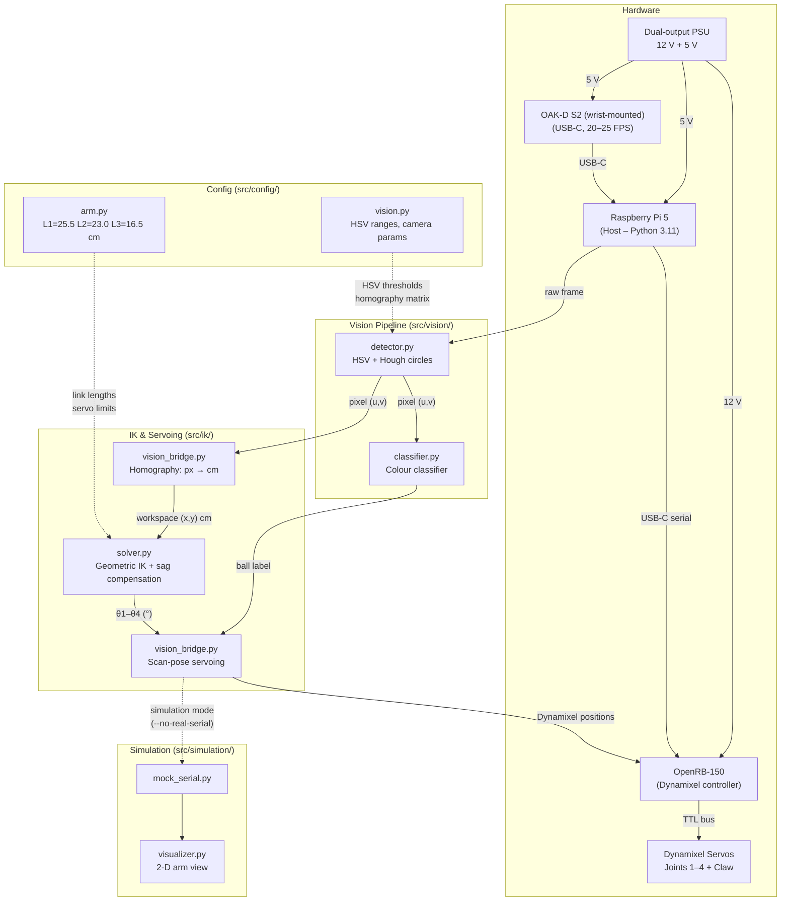

# System Architecture

**Autonomia — Autonomous Ball-Sorting Robot Arm**
Bachelor Project 2026

---

## 1. System Overview

Autonomia is an autonomous sorting system that uses a Luxonis OAK-D camera to detect coloured balls (red and blue) on a workspace, computes inverse kinematics for a 4-DOF robotic arm, and commands five Dynamixel servos via serial to pick up each ball and place it in the correct sorting bin. The system runs a continuous scan → approach → pick → sort → rescan loop, operating without human intervention once calibrated.

The following diagram shows the data flow from camera frame to servo command.



### 1.1 High-Level Component Diagram

```
┌─────────────────────────────────────────────────────────────────────────┐
│                        Raspberry Pi 5 (Python 3)                        │
│                                                                         │
│  ┌──────────┐    ┌──────────────┐    ┌────────────┐    ┌────────────┐  │
│  │ OAKCamera │───►│ SimpleBall   │───►│ Vision     │───►│ State      │  │
│  │ (depthai) │    │ Detector     │    │ Bridge     │    │ Machine    │  │
│  │           │    │ (HSV+Hough+  │    │ (homography│    │ (main.py)  │  │
│  │ 640×400   │    │  SVM+Kalman) │    │  px → cm)  │    │            │  │
│  └──────────┘    └──────────────┘    └────────────┘    └─────┬──────┘  │
│                                                              │         │
│                                                        ┌─────▼──────┐  │
│                                                        │ IK Solver  │  │
│                                                        │ (ArmIK)    │  │
│                                                        │ geometric  │  │
│                                                        │ 4-DOF      │  │
│                                                        └─────┬──────┘  │
│                                                              │ JSON    │
└──────────────────────────────────────────────────────────────┼─────────┘
                                                               │ USB-C
                                                               │ 115200 baud
                                                        ┌──────▼───────┐
                                                        │  OpenRB-150        │
                                                        │  (Dynamixel        │
                                                        │   controller)      │
                                                        └──────┬─────────────┘
                                                               │ TTL bus
                                          ┌────────────────────┼────────────────────┐
                                          │         │          │          │          │
                                       ┌──▼──┐  ┌──▼──┐  ┌───▼──┐  ┌──▼──┐  ┌──▼──┐
                                       │ m1  │  │ m2  │  │  m3  │  │ m4  │  │ m5  │
                                       │Base │  │Shldr│  │Elbow │  │Wrist│  │Claw │
                                       │XM430│  │XM540│  │XM430 │  │XL430│  │XL430│
                                       └─────┘  └─────┘  └──────┘  └─────┘  └─────┘

   Dual-output PSU
   ├── 12 V ──► OpenRB-150 (power jack)
   └──  5 V ──► Raspberry Pi 5 (USB-C power)
                OAK-D S2 (USB-C power)
   Felles minus (common GND) between all components
```

### 1.2 Data Flow Summary

```
OAK-D Camera  ──►  Homography  ──►  Detector  ──►  State Machine  ──►  IK Solver  ──►  Serial  ──►  Firmware  ──►  Motors
 (BGR frame)      (px → cm)       (HSV+Hough)     (IDLE→GRAB→DROP)   (x,y,z→steps)   (JSON)     (Dynamixel)    (5 axes)
```

---

## 2. Component Descriptions

### 2.1 OAK-D Camera

The `OAKCamera` class wraps the Luxonis OAK Series 2 camera (IMX378 sensor) via the DepthAI v3 pipeline API. It provides a `cv2.VideoCapture`-compatible interface (`open()`, `read()`, `release()`) that returns BGR NumPy frames. On startup, it discards 30 warm-up frames to allow auto-exposure and auto-white-balance to converge — critical when connected via USB 2.0 where the camera takes longer to stabilise.

| Property | Detail |
|---|---|
| **Input** | USB connection to OAK-D hardware |
| **Output** | `(bool, np.ndarray)` — success flag + BGR frame |
| **Resolution** | 640 × 400 (configurable, set in `src/config/vision.py`) |
| **HFOV** | 81° (IMX378 sensor) |
| **Focal length** | Read from EEPROM calibration; falls back to `(w/2) / tan(HFOV/2)` |
| **File** | [`src/vision/camera.py`](../src/vision/camera.py) |

### 2.2 Ball Detector

`SimpleBallDetector` implements an ensemble detection pipeline that combines multi-range HSV colour thresholding, Hough Circle Transform, SVM colour verification, and Kalman-filter tracking to reliably detect red and blue balls at 20–25 FPS.

The pipeline per frame:
1. Downscale to 0.75× for performance
2. Analyse lighting level (low / medium / high)
3. Apply CLAHE compensation on the LAB L-channel if lighting is low
4. Multi-range HSV detection (2 red ranges, 2 blue ranges) with morphological cleanup and contour validation (circularity ≥ 0.82, aspect ratio ≥ 0.80, solidity ≥ 0.75, vertex count > 6)
5. Hough Circle Transform with IoU-based shape verification
6. Ensemble merge via Union-Find clustering — detections confirmed by multiple methods receive a confidence boost
7. Post-merge NMS per colour
8. SVM colour verification (corrects label if ≥ 75% confident)
9. Per-colour limit (max N balls per colour)
10. Kalman-filter tracking for stable IDs across frames

| Property | Detail |
|---|---|
| **Input** | BGR frame (`np.ndarray`, 640 × 400) |
| **Output** | `List[DetectedBall]` — each with `color`, `center`, `radius`, `confidence`, `detection_method`, `track_id` |
| **Confidence** | ≥ 0.90 guaranteed for all balls passing gate filters; up to 1.0 for high-quality detections |
| **File** | [`src/vision/detector.py`](../src/vision/detector.py) |

### 2.3 Vision Bridge

`VisionBridge` adapts the vision pipeline for the IK state machine. It captures multiple frames (default: 5), selects the detection set with the highest total confidence, converts pixel coordinates to arm-frame centimetres via a calibrated perspective homography (`cv2.getPerspectiveTransform`), and displays a live annotated feed in an OpenCV window with a debug HUD (FPS, detection count, per-ball coordinates, tracker status).

The homography maps four workspace corners (pixel coordinates) to their physical positions in centimetres measured from the shoulder joint (motor 2 pivot). An optional `CAMERA_OFFSET_X`/`CAMERA_OFFSET_Y` fine-tuning offset is applied after the transform.

| Property | Detail |
|---|---|
| **Input** | `OAKCamera` frames + `SimpleBallDetector` results |
| **Output** | `List[dict]` — each `{"colour": str, "x": float, "y": float, "z": float}` in cm relative to shoulder joint |
| **Modes** | `use_camera=True` (real OAK-D) or `use_camera=False` (canned fake detections for simulation) |
| **Calibration** | Loaded from `homography_calibration.json` (auto-saved by `09_touch_calibration.py`); falls back to hardcoded defaults |
| **File** | [`src/ik/vision_bridge.py`](../src/ik/vision_bridge.py) |

### 2.4 State Machine

The master control loop in `main.py` implements a state machine that orchestrates the full pick-and-place cycle. It runs in a continuous `while True` loop: scan the workspace, process the first detected ball, return to HOME, and rescan for remaining balls.

| Property | Detail |
|---|---|
| **Input** | Detection dicts from `VisionBridge`, constants from `config/arm.py` |
| **Output** | Motor commands (JSON) sent via serial to the OpenRB-150 |
| **States** | `IDLE`, `MOVE_TO_SCAN_POSE`, `SCANNING`, `APPROACHING`, `GRABBING`, `VERIFY_GRIP`, `SORTING`, `DROPPING`, `DONE` |
| **Settle time** | 1.5 s per movement command (`MOVE_SETTLE_TIME`) when using real serial |
| **File** | [`src/main.py`](../src/main.py) |

### 2.5 IK Solver

`ArmIK` computes closed-form geometric inverse kinematics for the 4-DOF arm (base pan, shoulder tilt, elbow tilt, wrist tilt) plus a pass-through for the claw motor. Given a target `(x, y, z)` in centimetres, it returns Dynamixel step values (0–4095) for all five motors.

Key features:
- **End-effector offset**: adds `L3` (16.5 cm) to Z so the wrist hovers correctly while the claw points straight down
- **Sag compensation**: corrects for gravity droop using a linear or quadratic model loaded from `sag_calibration.json`
- **Shoulder height**: subtracts `shoulder_height` (33.0 cm) to convert workspace Z to the shoulder-relative frame
- **Joint limits**: clamps motor positions to safe ranges to prevent hardware overload errors
- **Partial approach**: `calculate_partial_move()` interpolates in Cartesian space for a partial (e.g., 80%) approach

| Property | Detail |
|---|---|
| **Input** | `(x, y, z)` target in cm, relative to shoulder joint |
| **Output** | `{"m1": int, "m2": int, "m3": int, "m4": int, "m5": int}` — Dynamixel steps |
| **Link lengths** | L1 = 25.5 cm, L2 = 23.0 cm, L3 = 16.5 cm |
| **Method** | Law of Cosines for shoulder and elbow; `atan2` for base; wrist compensates to point straight down |
| **File** | [`src/ik/solver.py`](../src/ik/solver.py) |

### 2.6 Serial / Firmware Bridge

The OpenRB-150 microcontroller runs firmware written in the Arduino framework (`openrb_bridge.ino`), flashed via the Arduino IDE, that acts as a USB bridge between the Raspberry Pi and the five daisy-chained Dynamixel motors. Communication uses newline-terminated JSON over USB-C at 115200 baud.

**Supported commands:**

| Command | Description | Response |
|---|---|---|
| `{"m1":N,"m2":N,"m3":N,"m4":N,"m5":N}` | Set goal positions for all 5 motors | `OK` |
| `{"cmd":"read_pos"}` | Read current positions of all motors | `{"m1":N,...,"m5":N}` |
| `{"cmd":"read_load"}` | Read Present Load from all motors (address 126) | `{"m1":N,...,"m5":N}` |
| `{"cmd":"set_profile","vel":V,"acc":A}` | Set motion profile (velocity, acceleration) | `{"status":"profile_set"}` |
| `{"cmd":"enable_torque"}` | Enable torque on all motors | `OK:TORQUE_ON` |
| `{"cmd":"clear_errors"}` | Reboot motors with latched hardware errors | `{"cleared":N}` |
| `{"cmd":"read_errors"}` | Read hardware error status registers | `{"m1":N,...,"m5":N}` |
| `{"cmd":"diagnose"}` | Multi-baud connectivity scan | `{"diagnostics":[...]}` |

On startup, the firmware pings all motors, clears any latched hardware errors (via reboot), configures Position Control mode with a smooth motion profile (velocity = 80, acceleration = 20), and sends `OK:READY`.

| Property | Detail |
|---|---|
| **Input** | JSON commands over USB serial (115200 baud) |
| **Output** | Motor goal positions via Dynamixel Protocol 2.0 over TTL bus |
| **Dependencies** | Dynamixel2Arduino, ArduinoJson v7+ |
| **File** | [`firmware/openrb_bridge/openrb_bridge.ino`](../firmware/openrb_bridge/openrb_bridge.ino) |

### 2.7 Configuration

Configuration is split into two modules:

**`src/config/arm.py`** — Physical arm parameters:
- `HOME_POSITION` = (20.0, 0.0, 30.0) cm — safe resting position
- `GRAB_HEIGHT` = 13.0 cm — Z when closing the claw
- `APPROACH_HEIGHT` = 24.0 cm — Z during the 80% XY approach
- `CLEARANCE_HEIGHT` = 28.0 cm — Z to lift to before traversing
- `VERIFY_HEIGHT` = 8.0 cm — Z to lift to for grip verification
- `CAMERA_OFFSET_X/Y` = 0.0 cm — fine-tuning offset (homography maps directly to shoulder frame)
- `BINS` — colour-to-position mapping: `RED_BIN` (20, 8, 10), `BLUE_BIN` (20, −8, 10), `REJECT_BIN` (25, 0, 12)
- Timing: `GRAB_DWELL` = 0.8 s, `RELEASE_DWELL` = 0.5 s
- Grip verification: `GRIP_VERIFY_TOLERANCE` = 30 steps, `GRIP_LOAD_THRESHOLD` = 50, `MAX_PICK_RETRIES` = 2

**`src/config/vision.py`** — Vision subsystem constants:
- `CAMERA_RESOLUTION` = (640, 400)
- `CAMERA_HFOV_DEG` = 81.0°
- `BALL_MIN_RADIUS` = 10 px, `BALL_MAX_RADIUS` = 150 px
- `BALL_CONFIDENCE_THRESHOLD` = 0.50

| File | Content |
|---|---|
| [`src/config/arm.py`](../src/config/arm.py) | Arm coordinates, bin positions, heights, timing |
| [`src/config/vision.py`](../src/config/vision.py) | Camera resolution, ball detection thresholds |

---

## 3. State Machine

The state machine in [`src/main.py`](../src/main.py) is defined by the `State` enum and driven by the `main()` function (continuous loop) and `run_sorting_cycle()` (single pick-and-place).

### 3.1 States

| State | Purpose |
|---|---|
| `IDLE` | Arm is at HOME, waiting. Logs detection details before a cycle begins. |
| `MOVE_TO_SCAN_POSE` | Move the arm to `SCAN_POSE` so the wrist-mounted camera has a valid view of the workspace. |
| `SCANNING` | `VisionBridge.scan_for_balls()` captures frames and returns detections. |
| `APPROACHING` | Two-phase approach: 80% partial move at `APPROACH_HEIGHT`, then 100% at `GRAB_HEIGHT`. |
| `GRABBING` | Close the claw, wait `GRAB_DWELL`, lift to `VERIFY_HEIGHT`. |
| `VERIFY_GRIP` | Grip verification via position check and load check. On failure, open claw and immediately re-scan (up to `MAX_PICK_RETRIES` attempts before skipping). On success, lift to `CLEARANCE_HEIGHT` and continue. |
| `SORTING` | Return to `HOME_POSITION` while carrying the ball. |
| `DROPPING` | Open the claw at HOME, wait `RELEASE_DWELL`. |
| `DONE` | Cycle complete. Control returns to the main loop for the next scan. |

### 3.2 State Diagram

```
                          ┌──────────────────────────────────┐
                          │          MAIN LOOP                │
                          │   (continuous while True)         │
                          └──────────┬───────────────────────┘
                                     │
                                     ▼
                              ┌──────────────────┐
                         ┌───►│ MOVE_TO_SCAN_POSE │
                         │    │ move arm to       │
                         │    │ SCAN_POSE         │
                         │    └──────┬───────────┘
                         │           │
                         │           ▼
                         │    ┌──────────────┐
                         │    │   SCANNING    │
                         │    │ scan_for_balls │
                         │    └──────┬───────┘
                         │           │
                         │     ┌─────▼──────┐  no balls    ┌─────────┐
                         │     │ detections? ├─────────────►│  IDLE   │
                         │     └─────┬───────┘  wait 3s     │ (wait)  │
                         │           │ yes                   └────┬────┘
                         │           ▼                            │
                         │    ┌──────────────┐                   │
                         │    │    IDLE       │◄──────────────────┘
                         │    │ log detection │       rescan
                         │    └──────┬───────┘
                         │           │
                         │           ▼
                         │    ┌──────────────────┐
                         │    │  APPROACHING      │
                         │    │  Phase 1: 80%     │
                         │    │  (APPROACH_HEIGHT) │
                         │    └──────┬───────────┘
                         │           │
                         │           ▼
                         │    ┌──────────────────┐
                         │    │  APPROACHING      │
                         │    │  Phase 2: 100%    │
                         │    │  (GRAB_HEIGHT)    │
                         │    └──────┬───────────┘
                         │           │
                         │           ▼
                         │    ┌──────────────┐
                         │    │  GRABBING     │
                         │    │  close claw   │
                         │    │  lift to      │
                         │    │  VERIFY_HEIGHT │
                         │    └──────┬───────┘
                         │           │
                         │           ▼
                         │    ┌──────────────────┐
                         │    │  VERIFY_GRIP      │
                         │    │  position check   │───── fail ──┐
                         │    │  + load check     │             │
                         │    └──────┬───────────┘             │
                         │           │ pass                     │
                         │           │                  ┌───────▼────────┐
                         │           │                  │ open claw,     │
                         │           │                  │ immediate      │
                         │           │                  │ re-scan        │
                         │           │                  │ (retry ≤ 2)    │
                         │           │                  └───────┬────────┘
                         │           │                          │
                         │           │                  ┌───────▼────────┐
                         │           │                  │ retries left?  │
                         │           │                  └──┬──────────┬──┘
                         │           │              yes │          │ no
                         │           │     (→ SCANNING) │          │ (skip ball
                         │           │                  │          │  → DONE)
                         │           ▼
                         │    ┌──────────────┐
                         │    │  SORTING      │
                         │    │  return HOME  │
                         │    └──────┬───────┘
                         │           │
                         │           ▼
                         │    ┌──────────────┐
                         │    │  DROPPING     │
                         │    │  open claw    │
                         │    └──────┬───────┘
                         │           │
                         │           ▼
                         │    ┌──────────────┐
                         │    │    DONE       │
                         │    └──────┬───────┘
                         │           │
                         └───────────┘  (MOVE_TO_SCAN_POSE → rescan)
```

### 3.3 Failure Modes and Recovery

| Failure | Handling |
|---|---|
| **No balls detected** | Main loop resets `scan_round` to 0, waits `IDLE_RESCAN_DELAY` (3 s), then rescans continuously. The OpenCV window stays responsive during the idle wait. |
| **Pick failed (grip verification)** | After closing the claw, the arm lifts to `VERIFY_HEIGHT` (8 cm) and checks grip via two methods: (1) **Position check** — if claw motor position reached `CLAW_CLOSED_POS` within `GRIP_VERIFY_TOLERANCE` (30 steps), the claw closed on air → pick failed; (2) **Load check** — if claw motor load exceeds `GRIP_LOAD_THRESHOLD` (50), something is being gripped → pick confirmed. On failure, the claw opens and the system immediately re-scans (skips idle delay). Up to `MAX_PICK_RETRIES` (2) attempts before skipping the ball. Helper functions: `read_positions()`, `read_load()`, `verify_grip()`. |
| **Camera fails to open** | `vision.open()` returns `False`; `main()` prints an error and exits immediately (no fallback to fake data in production mode). |
| **IK target unreachable** | `ArmIK.solve()` clamps targets beyond `max_reach` (L1 + L2 = 48.5 cm) to 99% of max reach, preserving the base angle. Targets too close raise `ValueError`. |
| **Motor overload / hardware error** | On startup, firmware reboots any motor with a latched hardware error. Python-side `clear_errors` command available. Joint limits in `ArmIK.JOINT_LIMITS` prevent commands that would cause overload. |
| **Unexpected serial response** | `send_command()` and `send_claw()` log a warning (`⚠️ Unexpected response`) but continue execution rather than aborting. |
| **KeyboardInterrupt** | Caught in the main loop; the arm returns to HOME before shutdown, then camera and serial are closed gracefully. |
| **User quit ('q' key)** | During idle rescan wait, pressing 'q' in the OpenCV window breaks the main loop and triggers graceful shutdown. |

### 3.4 Startup Sequence

The `smooth_startup()` function prevents sudden arm jerks on power-on:
1. Re-enable motor torque (in case 12V power was cycled)
2. Set a slow motion profile (velocity = 30, acceleration = 10)
3. Read current motor positions from the firmware
4. Interpolate from current positions to HOME in 10 steps over 1.5 s
5. Restore normal motion profile (velocity = 80, acceleration = 20)

Falls back to a direct (slow-profile) HOME command if position reading fails.

### 3.5 Wrist-Mounted Camera Constraint

Vision is only valid when the arm is at `SCAN_POSE`. The camera moves with the wrist (motors 1–4), so the homography calibration is only valid at the exact joint configuration where it was performed. Mid-approach visual correction was removed because the claw occludes the target ball during approach.

The state machine enforces this by always transitioning through `MOVE_TO_SCAN_POSE` before entering `SCANNING`, and again after `DROPPING` before the next scan cycle. The flow is: `HOME → MOVE_TO_SCAN_POSE → SCANNING → APPROACHING → GRABBING → VERIFY_GRIP → SORTING → DROPPING → MOVE_TO_SCAN_POSE → ...`

### 3.6 Timing Instrumentation

The `CycleTimer` class in [`src/main.py`](../src/main.py) tracks the wall-clock duration of each phase within a pick-and-place cycle: **scan**, **approach**, **grab**, **sort**, and **drop**. Phase transitions are recorded by calling `timer.start_phase(name)` at the beginning of each state.

After each successful cycle, a per-cycle summary is printed:

```
⏱️  Cycle time: 4.20s (scan: 0.30s, approach: 1.80s, grab: 0.50s, sort: 1.20s, drop: 0.40s)
```

On program exit (graceful shutdown or `KeyboardInterrupt`), a session summary is printed with average, minimum, and maximum durations across all completed cycles:

```
SESSION TIMING SUMMARY (5 cycles)
approach: avg 1.80s, grab: avg 0.50s, scan: avg 0.30s, sort: avg 1.20s, drop: avg 0.40s, total: avg 4.20s
```

This data is intended for the performance evaluation section of the thesis. See [`docs/performance.md`](performance.md) for expected phase durations.

---

## 4. Data Flow

### Step 1 — Camera Capture

The `OAKCamera` captures frames at 640 × 400 resolution using the DepthAI v3 pipeline API. The camera uses the IMX378 sensor with an 81° horizontal field of view. After a 30-frame warm-up for auto-exposure convergence, frames are delivered as BGR NumPy arrays via `cam.read()`.

**Output:** `np.ndarray` shape `(400, 640, 3)`, dtype `uint8`, BGR colour space.

### Step 2 — Homography Transform

`VisionBridge.pixel_to_cm()` maps any pixel coordinate `(u, v)` to workspace centimetres `(x_cm, y_cm)` using a 3×3 perspective homography matrix. The matrix is computed from four calibration point correspondences: four physical workspace corners measured in cm from the shoulder joint, and their corresponding pixel positions in the camera frame. The transform is loaded from `homography_calibration.json` on startup.

**Transform:** `cv2.perspectiveTransform(pixel_point, H)` → `(x_cm, y_cm)` + `CAMERA_OFFSET_X/Y`.

### Step 3 — Ball Detection

`SimpleBallDetector.detect_balls()` runs the full ensemble pipeline:
1. Downscale to 75% (480 × 300) for processing speed
2. Convert to HSV and grayscale
3. Apply adaptive HSV ranges (widened at low light, tightened at high light)
4. Build binary masks via `cv2.inRange()` for each HSV range, union them, then morphological open (3×3) + close (13×13) + flood-fill hole filling
5. Find contours and validate each: area, radius, circularity (≥ 0.82), aspect ratio (≥ 0.80), solidity (≥ 0.75), vertex count (> 6)
6. Run Hough Circle Transform on grayscale and validate via colour sampling and IoU against an ideal circle
7. Merge HSV and Hough detections via Union-Find clustering; multi-method detections receive an 8% confidence boost
8. SVM colour classifier overrides the label if ≥ 75% confident (trained on histogram features from `ball_color_classifier.pkl`)
9. Kalman-filter tracker assigns persistent IDs and smooths positions across frames

**Output:** `List[DetectedBall]` with fields `color` (BallColor enum), `center` (pixel), `radius`, `confidence`, `detection_method`, `track_id`.

### Step 4 — Coordinate Conversion

`VisionBridge.scan_for_balls()` captures 5 frames, selects the best detection set (highest total confidence), resets the Kalman tracker between scan rounds (to avoid phantom balls from the previous round), then converts each `DetectedBall` pixel position to arm-frame centimetres via the homography.

**Output:** `[{"colour": "red", "x": 20.3, "y": 5.1, "z": 0.0}, ...]` — ready for the state machine.

### Step 5 — IK Computation

`ArmIK.solve(x, y, z)` computes motor positions:
1. Clamp Z to `Z_MIN` (6.0 cm) — floor collision prevention
2. Add `L3` (16.5 cm) to Z — end-effector offset so claw tip reaches target
3. Add sag compensation: `z_ik += reach × z_offset_multiplier` (linear model, loaded from `sag_calibration.json`)
4. Subtract `shoulder_height` (33.0 cm) to convert to the shoulder-relative frame
5. Base angle: `θ_base = atan2(y, x)`
6. Planar distance: `d = sqrt(r² + z_ik²)`, with reachability clamping
7. Elbow angle: Law of Cosines on triangle (L1, L2, d)
8. Shoulder angle: Law of Cosines + `atan2(z_ik, r)`
9. Wrist angle: compensate so claw points straight down (`−π/2 − (θ_shoulder − θ_elbow)`)
10. Convert radians to Dynamixel steps (0–4095, centre = 2048)
11. Enforce joint limits and clamp

**Output:** `{"m1": int, "m2": int, "m3": int, "m4": int, "m5": int}`.

### Step 6 — Serial Transmission

The Python-side `send_command()` serialises the motor dict as JSON and writes it to the serial port followed by `\n`. It then waits for an `OK\n` acknowledgement. After each command, the system waits `MOVE_SETTLE_TIME` (1.5 s) for the physical arm to reach the target.

**Wire format:** `{"m1":2048,"m2":1820,"m3":2201,"m4":2075,"m5":2048}\n`

### Step 7 — Firmware Execution

The OpenRB-150 firmware (`openrb_bridge.ino`) receives the JSON, deserialises it with ArduinoJson v7, validates that all five motor keys are present and within range (0–4095), then calls `dxl.setGoalPosition()` for each motor using the Dynamixel2Arduino library. The motion profile (velocity = 80, acceleration = 20) ensures smooth, non-jerky movement.

### Step 8 — Motor Actuation

The five Dynamixel servos (XM430 × 2, XM540 × 1, XL430 × 2) execute the goal positions using their internal PID controllers with the configured trapezoidal velocity profile. The motors are daisy-chained on a TTL bus at 115200 baud, using Dynamixel Protocol 2.0.

---

## 5. Design Decisions (Summary)

| Decision | Summary | ADR |
|---|---|---|
| Classical HSV vision over CNN | HSV + Hough + SVM ensemble chosen for deterministic behaviour, no training data requirement, and real-time performance. Three prior attempts (CNN, complex pipeline) failed. | [ADR-001](decisions/001-hsv-over-cnn.md) |
| Geometric 4-DOF IK | Closed-form solution using Law of Cosines chosen for exact results, fast computation, and predictable behaviour. Sag compensation added as post-processing. | [ADR-002](decisions/002-4dof-geometry.md) |
| Fixed scan pose over continuous visual servoing | Camera is wrist-mounted; vision only works from a fixed `SCAN_POSE`. The arm moves to this known joint configuration before every scan. Homography is calibrated once at this pose. Mid-approach visual correction was removed because the claw occludes the target ball during approach. | [ADR-003](decisions/003-fixed-scan-pose.md) |

---

## 6. Calibration Pipeline

The system requires a 10-step calibration pipeline before autonomous operation. Each step builds on previous ones. Total time: approximately 55–80 minutes.

### Phase A — Arm Hardware (no camera needed)

| Step | Script | Purpose |
|:---:|---|---|
| **0** | Dynamixel Wizard 2.0 | Set motor IDs (1–5), baudrate (115200), operating mode (Position Control) for each motor individually before assembly |
| **1** | Upload `openrb_bridge.ino` | Flash the USB bridge firmware to the OpenRB-150 via Arduino IDE |
| **2** | `src/calibration/02_joints.py` | Drive each motor one at a time to verify sign conventions, zero positions, and rotation directions |
| **2b** | `src/calibration/02b_claw.py` | Tune claw open (`CLAW_OPEN_POS`) and close (`CLAW_CLOSED_POS`) positions for reliable gripping |
| **2c** | Manual | Tune `SCAN_POSE` joint positions for wrist-mounted camera workspace coverage |
| **3** | `src/calibration/03_sag.py` | Measure gravity droop at 5 reach distances, fit a linear/quadratic compensation model, and save to `sag_calibration.json` |

### Phase B — Vision Setup (camera needed)

| Step | Script | Purpose |
|:---:|---|---|
| **4** | `src/calibration/04_hsv_tuner.py` | Interactive live HSV range tuning with trackbars under actual lighting conditions |
| **5** | `src/calibration/05_hsv_refine.py` | Statistical refinement of HSV ranges from captured training images |
| **6** | `src/calibration/09_touch_calibration.py` | Click 4 workspace corners in the camera feed, drive the arm to touch each corner → compute the pixel-to-cm perspective transform |


### Phase C — Integration (arm + camera together)

| Step | Script | Purpose |
|:---:|---|---|
| **7** | `src/calibration/07_vision_offset.py` | Fine-tune residual `CAMERA_OFFSET_X/Y` by comparing detected vs. actual ball positions |
| **8** | `src/calibration/08_pick_test.py` | End-to-end pick-and-place verification at 5 workspace positions; target: ≥ 80% clean picks |

For detailed calibration instructions, see the [README Calibration Guide](../README.md#-calibration-guide-first-time-setup).
