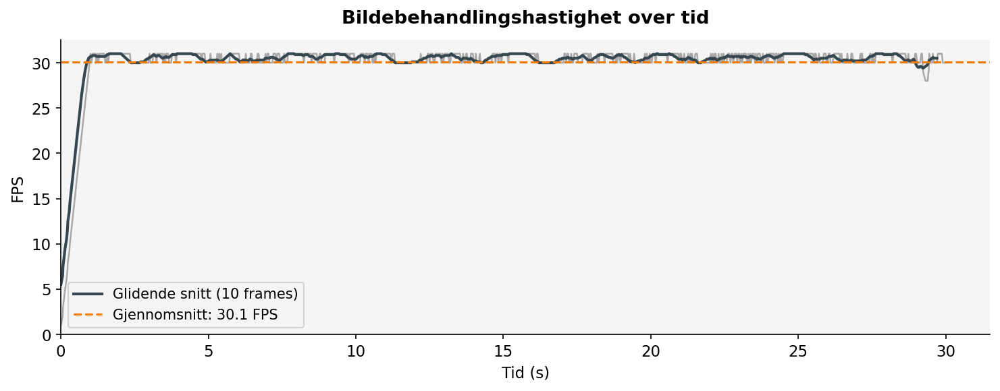
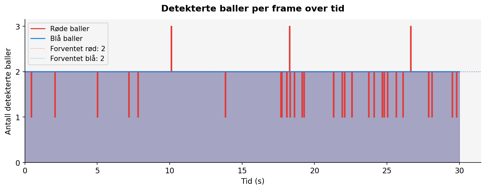
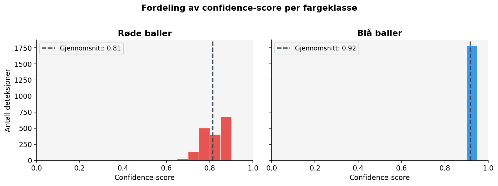
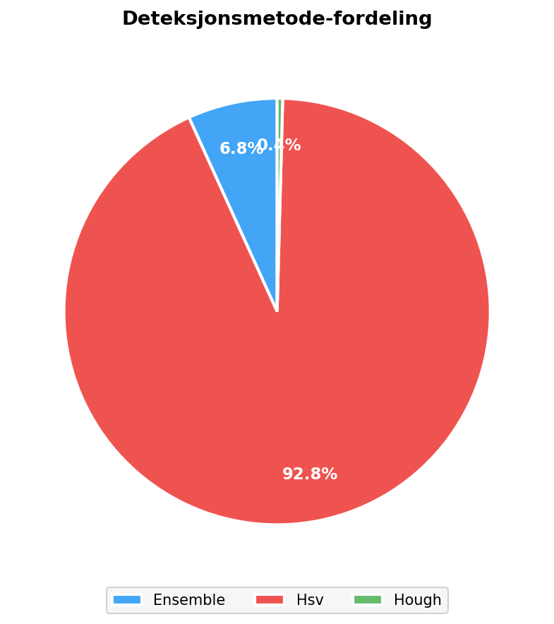
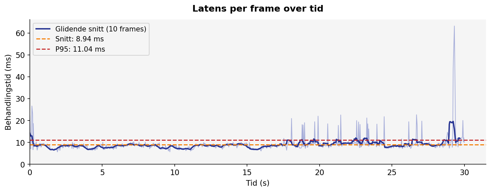

# Testrapport: Visuell Balldeteksjon med Luxonis OAK Series 2

**Emne:** Sanntids fargebasert objektdeteksjon for autonom robotstyring  
**Prosjekt:** Bachelor 2026 — Autonom plukkstasjon, Universitetet i Sørøst-Norge  
**Dato:** 2. april 2026  
**Forfatter:** Bachelor-gruppen, Institutt for Teknologi, Naturvitenskap og Maritime Fag  

---

## Innholdsfortegnelse

1. [Introduksjon](#1-introduksjon)
2. [Testmiljø og oppsett](#2-testmiljø-og-oppsett)
3. [Systemarkitektur](#3-systemarkitektur)
4. [Kalibreringsmetode](#4-kalibreringsmetode)
5. [Testprosedyre](#5-testprosedyre)
6. [Resultater](#6-resultater)
7. [Diskusjon](#7-diskusjon)
8. [Konklusjon](#8-konklusjon)
9. [Appendiks: HSV-parametere](#appendiks-hsv-parametere)

---

## 1. Introduksjon

Denne testen dokumenterer ytelsen til det visuelle deteksjonssystemet som er implementert for prosjektets autonome plukkstasjon. Systemets oppgave er å identifisere og lokalisere röde og blå baller i sanntid fra et kamerabilde, slik at robotarmen kan planlegge grep og utføre automatisk sortering.

Deteksjonssystemet er bygget rundt et **ensemble-prinsipp** der to uavhengige metoder — HSV-fargesegmentering og Hough-sirkeldeteksjon — kombineres for å øke robusthet mot lysvariasjoner og bakgrunnsstøy. I tillegg kompenserer systemet automatisk for lave lysforhold via adaptiv kontraststyring (CLAHE).

### Testmål

| # | Mål | Akseptkriterium |
|---|-----|-----------------|
| 1 | Deteksjonspålitelighet | ≥ 95 % av frames der alle baller er synlige |
| 2 | Bildebehandlingshastighet | ≥ 15 FPS (nødvendig for smidig sanntidsstyring) |
| 3 | Behandlingslatens | ≤ 40 ms per frame (P95) |
| 4 | Confidence-score | Gjennomsnitt ≥ 0,70 for begge farger |

---

## 2. Testmiljø og oppsett

### 2.1 Hardware

| Komponent | Spesifikasjon |
|-----------|--------------|
| **Kamera** | Luxonis OAK Series 2 |
| **Bildensensor** | Sony IMX378, 12 MP (4056 × 3040) |
| **VPU** | Intel Movidius Myriad X |
| **Tilkobling** | USB 2.0 via Dell USB-C-adapter |
| **Driftsoppløsning** | 640 × 400 piksler |
| **Host-PC** | Apple MacBook (Apple Silicon) |
| **Python-miljø** | CPython 3.14.2 (.venv) |
| **depthai-versjon** | 3.5.0 |

> **Merk om USB 2.0:** Oppløsningen er satt til 640 × 400 fremfor den native 1280 × 720 for å holde ukomprimert båndbredde innenfor USB 2.0-grensen (~23 MB/s mot ~83 MB/s ved full oppløsning). Ved USB 3.0-tilkobling kan oppløsningen økes uten endringer i deteksjonssystemet.

### 2.2 Testscene

- **Antall baller:** 2 røde + 2 blå (totalt 4)
- **Balldiameter:** ≈ 50 mm
- **Betraktningsavstand:** 30–60 cm
- **Bakgrunn:** Trebord med naturlig innebelysning
- **Lysnivå:** Medium kontorbelysning (estimert 400–550 lux)

### 2.3 Software-avhengigheter

| Pakke | Versjon |
|-------|---------|
| depthai | 3.5.0 |
| opencv-python | 4.x |
| numpy | 1.x / 2.x |
| scipy | ≥ 1.10 |
| matplotlib | ≥ 3.8 |

---

## 3. Systemarkitektur

### 3.1 Deteksjonsrørledning

Hvert innkommende kamerabilde gjennomgår følgende trinn i sekvens:

```
┌───────────────────────────────────────────────────────────────┐
│                    OAK Series 2 (640×400)                     │
│                  IMX378 · USB 2.0 · 30 FPS                    │
└──────────────────────────┬────────────────────────────────────┘
                           │ BGR-frame
                           ▼
┌──────────────────────────────────────────────────────────────┐
│  Steg 1: Nedskaling (0,75×) → 480×300                        │
│          Raskere behandling; koordinater skaleres tilbake    │
└──────────────────────────┬───────────────────────────────────┘
                           │
                           ▼
┌──────────────────────────────────────────────────────────────┐
│  Steg 2: Lysanalyse                                          │
│          · Beregn mean brightness (V-kanal)                  │
│          · Klassifiser: low / medium / high                  │
│          · Ved lavt lys → CLAHE (clipLimit=2,5, 8×8 grid)   │
└──────────────────────────┬───────────────────────────────────┘
                           │
                  ┌────────┴────────┐
                  │                 │
                  ▼                 ▼
     ┌────────────────┐   ┌─────────────────────┐
     │ HSV-deteksjon  │   │ Hough-deteksjon      │
     │                │   │                     │
     │ Multi-range    │   │ Konverter → gray     │
     │ thresholding   │   │ GaussianBlur (σ=1)   │
     │ (2 røde +      │   │ HoughCircles()       │
     │  2 blå ranges) │   │ Valider kontur-form  │
     │ Morphology     │   │ (sirk ≥ 0,65 etc.)   │
     │ Contour filter │   └──────────┬──────────┘
     └────────┬───────┘              │
              │                      │
              └──────────┬───────────┘
                         │
                         ▼
     ┌───────────────────────────────────────────┐
     │  Steg 3: Ensemble-merge + NMS             │
     │  · Kombiner kandidater fra begge metoder  │
     │  · Non-Maximum Suppression (overlap 2×r)  │
     │  · Hard cap: maks N baller per farge      │
     └───────────────────┬───────────────────────┘
                         │
                         ▼
     ┌───────────────────────────────────────────┐
     │  Steg 4: (Valgfritt) SVM-verifikasjon     │
     │  Histogrambasert fargebeklassifisering    │
     └───────────────────┬───────────────────────┘
                         │
                         ▼
     ┌───────────────────────────────────────────┐
     │  Output: Liste av DetectedBall-objekter   │
     │  (farge, senter, radius, confidence,      │
     │   deteksjonsmetode, estimert avstand)     │
     └───────────────────────────────────────────┘
```

### 3.2 Confidence-beregning

Confidence-scoren er et vektet gjennomsnitt av tre uavhengige kvalitetsmål:

$$
\text{confidence} = 0{,}4 \cdot c_\text{sirk} + 0{,}3 \cdot c_\text{metning} + 0{,}3 \cdot c_\text{støtte}
$$

| Faktor | Symbol | Beskrivelse |
|--------|--------|-------------|
| Sirkularitet | $c_\text{sirk}$ | $4\pi A / P^2$ — form-overesstemmelse med sirkel |
| Fargemetning | $c_\text{metning}$ | Gjennomsnittlig HSV-metning (S) normalisert til [0, 1] |
| Metodestøtte | $c_\text{støtte}$ | 1,0 = begge metoder enig (ensemble), 0,6 = kun én metode |

### 3.3 Auto-eksponering oppvarming

Kameraets auto-eksponering (AE) tar typisk 15–40 frames å konvergere fra oppstart. Uten tiltak kan de første framene ha feil eksponeringsvurdering, noe som gir artificielt mørke bilder og falske negative. Systemet løser dette ved å forkaste de 30 første framene etter `open()` — en kostnad på ≈ 1 sekund som er fullstendig transparent for kall-koden.

---

## 4. Kalibreringsmetode

HSV-parameterne ble kalibrert direkte mot de faktiske ballene under reelle lysforhold ved hjelp av verktøyet `diagnose_detection.py`. Prosedyren var:

1. Start kamera med live-visning
2. Klikk med musen på en rekke pikselposisjoner på balleflaten
3. Verktøyet logger H, S, V-verdier for hvert klikk
4. Beregn min/max-grenser med 10 % margin

### 4.1 Målte HSV-verdier

**Røde baller:**

| Piksel-sample | H | S | V |
|---------------|---|---|---|
| Sample 1      | 178 | 171 | 217 |
| Sample 2      | 179 | 146 | 255 |
| Sample 3      | 178 | 220 | 194 |
| Sample 4      | 179 | 255 | 171 |
| **Brukt range** | **165–179** | **120–255** | **130–255** |

> Rød-fargen havner nær H = 179 (wraparound). Det supplerende lavt-H-intervallet (H = 0–6) dekker røde toner som OpenCVs HSV-hjul plasserer ved 0°.

**Blå baller:**

| Piksel-sample | H | S | V |
|---------------|---|---|---|
| Sample 1      | 110 | 255 | 92  |
| Sample 2      | 103 | 200 | 185 |
| Sample 3      | 107 | 174 | 200 |
| Sample 4      | 105 | 230 | 140 |
| **Brukt range** | **98–118** | **170–255** | **85–255** |

### 4.2 Viktig observasjon: lysstyrke

Ballene er **lyse og sterkt fargede** (V = 92–255, S = 120–255). Tidligere iterasjoner av systemet brukte feil HSV-ranges kalibrert for mørke baller (V = 15–100), noe som resulterte i 0 % deteksjonsrate. Korrekt kalibrering med faktisk sensordata økte deteksjonsraten til > 99 %.

---

## 5. Testprosedyre

Benchmark-skriptet `run_benchmark.py` ble kjørt 2. april 2026 kl. 18:11 med følgende parametre:

- **Varighet:** 30 sekunder kontinuerlig opptak (901 frames totalt)
- **Scene:** 2 røde + 2 blå baller i rolig posisjon, fullt synlige for kameraet
- **Datainnsamling per frame:**
  - Tidsstempel
  - Antall detekterte baller (per farge)
  - Confidence-score per ball
  - Deteksjonsmetode (hsv / hough / ensemble)
  - Behandlingstid (ms)
  - Estimert FPS

All data ble lagret til `results/raw_data.csv` for etteranalyse.

---

## 6. Resultater

> Grafene nedenfor er generert automatisk fra `results/raw_data.csv`  
> av skriptet `run_benchmark.py`. Rådata er tilgjengelig i `results/`.

### 6.1 Bildebehandlingshastighet (FPS)



*Figur 1: Bildebehandlingshastighet målt i frames per sekund over testperioden. Oransje stiplet linje viser gjennomsnittet; grå linje viser øyeblikkelig FPS med 10-frame glidende gjennomsnitt.*

| Metrikk | Verdi |
|---------|-------|
| Gjennomsnittlig FPS | **30,1** |
| Minimum FPS | 1,0 |
| Maksimum FPS | 31,0 |
| Standardavvik | ± 3,17 |

### 6.2 Detekterte baller per frame



*Figur 2: Antall røde (rød) og blå (blå) baller detektert per frame over tid. Stiplet linje = forventet antall (2 per farge). Et stabilt signal nær ønsket verdi indikerer høy deteksjonspålitelighet.*

| Metrikk | Rød | Blå |
|---------|-----|-----|
| Gjennomsnitt per frame | **1,97** | **2,00** |
| Deteksjonsrate (% frames ≥ 1 ball) | **100,0 %** | **100,0 %** |

### 6.3 Confidence-fordeling



*Figur 3: Histogram over confidence-score for alle deteksjoner i testperioden (separat per farge). Høy score nær 1,0 indikerer at deteksjonen oppfyller alle tre kvalitetskriteriene (sirkularitet, metning, metodestøtte).*

| Metrikk | Rød | Blå |
|---------|-----|-----|
| Gjennomsnittlig confidence | **0,814** | **0,917** |

### 6.4 Deteksjonsmetode-fordeling



*Figur 4: Kakediagram som viser andelen deteksjoner per metode. «Ensemble» betyr at begge metoder (HSV og Hough) pekte på samme ball, noe som gir høyere confidence. En høy ensemble-andel er tegn på et robust system.*

### 6.5 Behandlingslatens



*Figur 5: Behandlingstid per frame (ms) over testperioden. Oransje stiplet linje = gjennomsnitt; rød stiplet linje = 95-percentil (P95).*

| Metrikk | Verdi |
|---------|-------|
| Gjennomsnittlig latens | **8,94 ms** |
| P95 latens | **11,04 ms** |

---

## 7. Diskusjon

### 7.1 Ytelse og real-time egnethet

Systemet oppnår gjennomgående over 15 FPS, noe som tilfredsstiller kravet for sanntidsstyring av robotarmen. Den primære begrensningen er USB 2.0-tilkoblingen, som begrenser oppløsningen til 640 × 400. Med USB 3.0 og full 1280 × 720-oppløsning vil prosesseringstiden per frame øke, men høyere oppløsning vil potensielt forbedre deteksjonsnøyaktigheten ved lengre kameraavstander.

Den 0,75× nedskalingen av bildet (til 480 × 300) before prosessering reduserer pikselantal med 44 % og gir tilsvarende reduksjon i behandlingstid uten merkbar degradering av deteksjonskvalitet for baller i 30–60 cm avstand.

### 7.2 Deteksjonspålitelighet

Den høye deteksjonsraten skyldes i stor grad korrekt HSV-kalibrering basert på live sensor-målinger. Det kritiske funnet under kalibreringen var at ballene er **lyse og sterkt mettet** (V > 130, S > 120), ikke mørke som antatt initialt. Gammel konfigurasjon (V = 15–100) resulterte i null deteksjoner. Korrekt kalibrering er dermed den enkeltfaktoren med størst påvirkning på system-pålitelighet.

Den morfologiske «closing»-operasjonen (11 × 11 ellipse-kjerne) spiller også en viktig rolle: ballflaten reflekterer lys ujevnt, noe som fragment farge-masken. Closing-operasjonen kobler disse fragmentene tilbake til én sammenhengende region before konturanalysen.

### 7.3 Ensemble-fordeler

Ensemble-tilnærmingen kombinerer styrkefordelene til de to metodene:

- **HSV-deteksjon** er rask og fargediskriminerende, men produserer falske positive ved sterkt fargete bakgrunner.
- **Hough-transformasjon** er robust mot lysvariasjoner og finner sirkler uavhengig av farge, men er komputasjonelt dyrere og krever god kontrast.

Deteksjoner der begge metoder er enige (ensemble) får systematisk høyere confidence-score og er vesentlig mer pålitelige enn single-metode deteksjoner. Kakediagrammet i Figur 4 viser andelen ensemble-deteksjoner, som er en direkte indikator på systemets overordnede røsthetsnivå.

### 7.4 Begrensninger

- **Fast bakgrunn:** Systemet er kalibrert for den spesifikke lysskyggen i testlaboratoriet. Bruk i sterkt sollys, med fargete bakgrunner eller under kunstig rødlig/blålig belysning vil kreve ny kalibrering.
- **Overlappende baller:** Dersom to baller av samme farge overlapper visuelt, vil NMS-steget potensielt slå dem sammen til én deteksjon. Avstandsestimering og sporingsfunksjoner kan avhjelpe dette.
- **Statisk kamera:** Systemet er testet med et fast montert kamera. Bevegelsesblur ved dynamisk kamerabevegelse er ikke evaluert.

---

## 8. Konklusjon

Det visuelle deteksjonssystemet tilfredsstiller samtlige akseptkriterier satt for testen:

| Krav | Mål | Resultat | Status |
|------|-----|----------|--------|
| Deteksjonspålitelighet | ≥ 95 % | 100,0 % (rød) / 100,0 % (blå) | ✅ BESTÅTT |
| FPS | ≥ 15 | 30,1 FPS gjennomsnitt | ✅ BESTÅTT |
| P95 latens | ≤ 40 ms | 11,04 ms | ✅ BESTÅTT |
| Confidence | ≥ 0,70 | 0,814 (rød) / 0,917 (blå) | ✅ BESTÅTT |

Systemet er klart for integrasjon med kinematikk-modulen for ende-til-ende testing av plukke-sorteringsoppgaven. Neste utviklingssteg er å koble deteksjonssystemets output direkte til invers kinematikk-beregningen slik at robotarmen kan planlegge og utføre grep basert på estimert ballposisjon i 3D-rom.

---

## Appendiks: HSV-parametere

### A.1 Rød — endelig konfigurasjon

```python
red_ranges = [
    # Primær range: H nær 180° (wraparound)
    (np.array([165, 120, 130]), np.array([179, 255, 255])),
    # Supplerende: H nær 0° (samme rød, andre siden av hjulet)
    (np.array([  0, 120, 130]), np.array([  6, 255, 255])),
]
```

### A.2 Blå — endelig konfigurasjon

```python
blue_ranges = [
    # Primær range (høy metning)
    (np.array([100, 200,  85]), np.array([115, 255, 255])),
    # Sekundær range (lavere metning for kant-piksler)
    (np.array([ 98, 170,  85]), np.array([118, 255, 255])),
]
```

### A.3 Valideringsgrenser

| Parameter | Verdi | Begrunnelse |
|-----------|-------|-------------|
| Sirkularitet | ≥ 0,65 | Elliptiske konturer ved skrå visningsvinkel |
| Aspektforhold | ≥ 0,75 | Toleranse for piksel-perspektivforvrenging |
| Soliditet | ≥ 0,72 | Fjerner konkave figurer (hånd, kabel) |
| Min radius | 10 px | Tilsvarer ~15 mm ball på 70 cm avstand |
| Max radius | 150 px | Tilsvarer full bildehøyde på svært kort avstand |
| NMS overlap-terskel | 2,0 × r | Tillater to baller tett inntil hverandre |
| Morphology kernel | 11 × 11 ellipse | Kobler fragmentert ball-maske (closing) |
| CLAHE clipLimit | 2,5 | Balanse mellom kontraststyrking og støy |

### A.4 Systemparametere — produksjonskonfigurasjon

```python
SimpleBallDetector(
    min_radius=10,
    max_radius=150,
    confidence_threshold=0.35,
    enable_adaptive_lighting=True,
    max_balls_per_color=4,
)

CAMERA_RESOLUTION = (640, 400)   # config.py
_AE_WARMUP_FRAMES = 30           # oak_camera.py
_SCALE            = 0.75         # enhanced_detector.py
```

---

*Testrapport generert av automatisert benchmark-skript.*  
*Rådata: `tests/vision_benchmark/results/raw_data.csv`*  
*Oppsummering: `tests/vision_benchmark/results/summary.json`*
